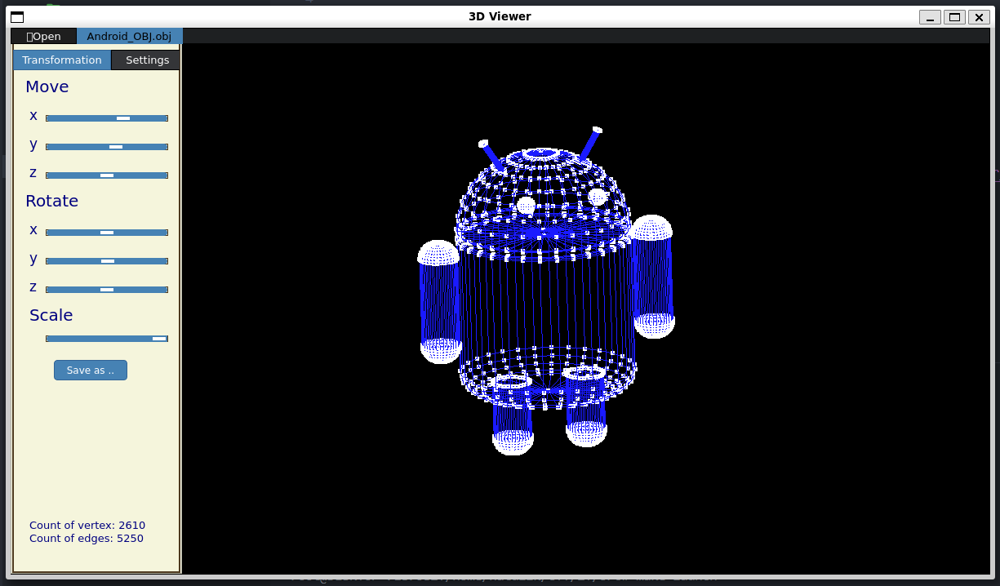

# 3DViewer v2.0



## Содержание

1. [Возможности](#возможности)
2. [Зависимости](#зависимости)
3. [Установка](#установка)
4. [Запуск](#запуск)
5. [Сжатие файлов](#сжатие-файлов)
6. [Удаление](#удаление)
7. [Инструкция по использованию 3D_Viewer_v2](#инструкция-по-использованию-3d_viewer_v2)
   - [Загрузка модели](#загрузка-модели)
   - [Взаимодействие с моделью](#взаимодействие-с-моделью)
   - [Настройки](#настройки)
   - [Сохранение изображения](#сохранение-изображения)
   - [Создание скринкаста](#создание-скринкаста)

## Возможности

- Графический интерфейс
- Загрузка каркасной модели из файлов типа .obj (поддерживает только список вершин и граней)
- Перемещение модели на указанное расстояние относительно осей X, Y, Z
- Поворот модели на заданный угол относительно ее осей X, Y, Z
- Масштабирование модели на заданное значение
- Выбор типа проекции (параллельная или центральная)
- Выбор способа отображения ребер (сплошные или пунктирные)
- Выбор способа отображения вершин (круг, квадрат или не отображать)
- Изменение толщины ребер
- Изменение размера вершин
- Изменение цвета фона, ребер и вершин
- Сохранение изображения модели в форматах .jpeg и .bmp
- Сохранение GIF-анимации модели в формате .gif (640x480, 10fps, 5s)

## Зависимости

Убедитесь, что у вас установлены следующие пакеты:

- `GCC`
- `G++`
- `MAKE`
- `CMAKE`
- `QT5` или новее
- `OpenGL API`

## Установка

- Из папки `src` выполните следующую команду (исполняемый файл будет находиться в папке `src`):

    ```sh
    make install
    ```

## Запуск

- Из папки `src` выполните следующую команду или дважды щелкните на исполняемом файле 3DViewer:

    ```sh
    make launch
    ```

## Сжатие файлов

- Из папки `src` выполните следующую команду (архив будет находиться в папке `src`):

    ```sh
    make dist
    ```

## Удаление

- Из папки `src` выполните следующую команду:

    ```sh
    make uninstall
    ```

## Инструкция по использованию 3D_Viewer_v2

### Загрузка модели

1. В главном окне нажмите на кнопку "Open" и выберите объектный файл — загрузится каркасная модель.

### Взаимодействие с моделью

1. **Перемещение:** Перемещать модель можно при помощи ползунков под "Move" по осям x, y, z соответственно или зажав правую кнопку мыши.
2. **Поворот:** Поворачивать модель можно при помощи ползунков под "Rotate" по осям x, y, z соответственно или зажав левую кнопку мыши.
3. **Масштаб:** Можно увеличивать или уменьшать размер модели при помощи ползунка под "Scale" или при помощи колесика мыши.

### Настройки

1. **Ребра:** Можно настроить тип ребер, их толщину и цвет.
2. **Вершины:** Можно настроить тип отображения вершин, величину отображаемых вершин и их цвет в рамке.
3. **Тип проекции:** Можно настраивать тип проекции при помощи соответствующих кнопок.
4. **Фон:** Можно выбрать цвет фона по кнопке "Set Background".

Все выбранные настройки сохраняются между перезапусками программы.

### Сохранение изображения

1. Загрузите каркасную модель.
2. Нажмите кнопку "Save as ..", выберите формат скриншота bmp/jpeg и директорию, и нажмите "Save" — в директории сохранится скриншот модели.

### Создание скринкаста (GIF)

1. Загрузите каркасную модель.
2. Для создания скринкаста текущих пользовательских преобразований модели в GIF-анимацию с размером 640x480, 10 кадрами в секунду и продолжительностью 5 секунд, нажмите кнопку "GIF".
3. Нажмите кнопку "Save as .." и выберите gif.
4. Вертите моделью как вздумается. У вас есть 5 секунд.
5. Выберите название гифки, директорию сохранения и нажмите "Save".
6. GIF-анимация будет сохранена в выбранной директории.
